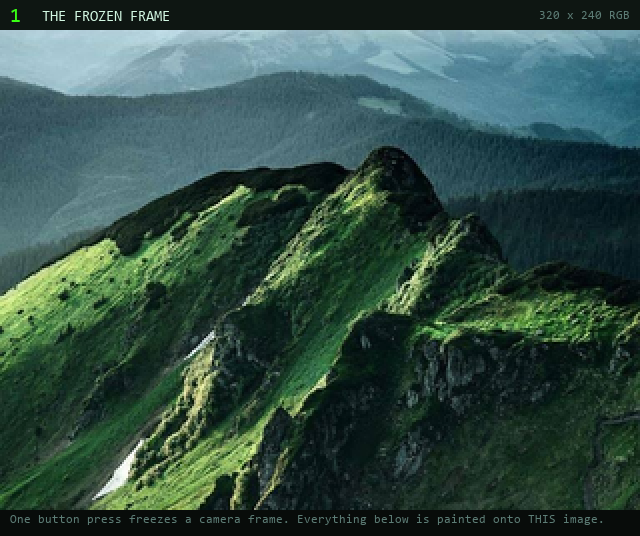
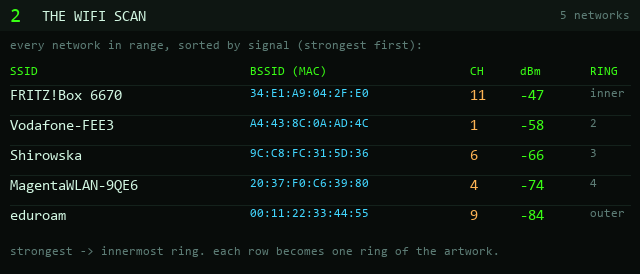
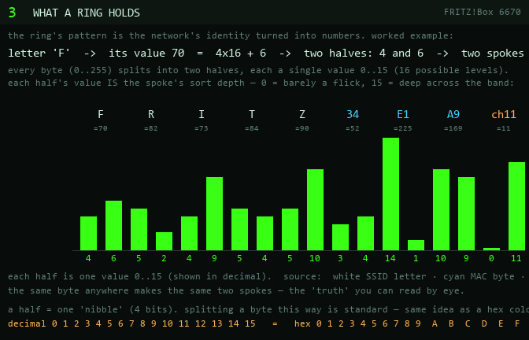
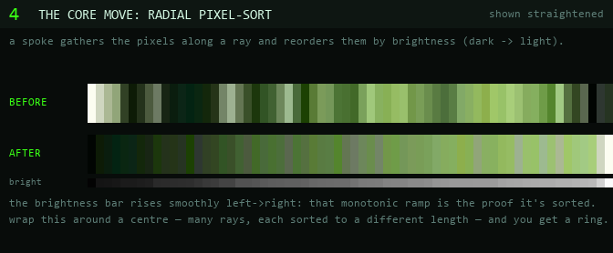
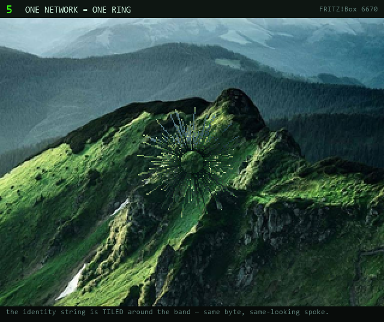
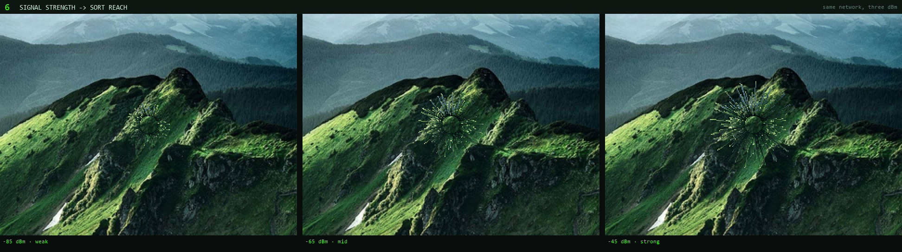
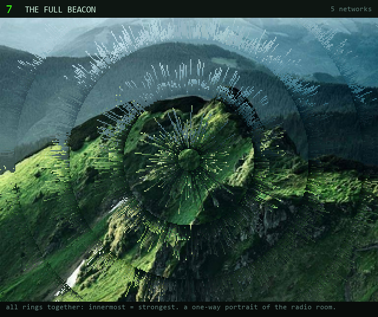
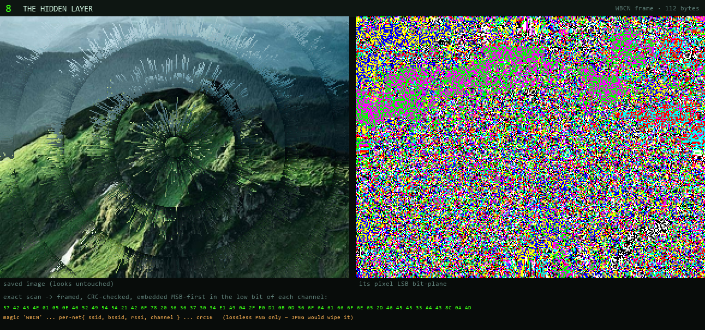

# How a Wi-Fi scan becomes the image

A step-by-step walkthrough of BEACON's encoder — from the moment you press the
button to the two layers baked into the saved PNG.

Every render below is produced by the **real device encoder** (`wifi_rings.c`,
the same C that runs on the ESP32-S3), driven by
[`tools/encoding_steps.py`](../tools/encoding_steps.py). The diagram figures are
drawn from the same scan and the real `WBCN` frame builder. The ring renders use
slightly **widened bands** so the mechanism reads on a smooth photo — it's the
same encoder, just exaggerated geometry; the device default is subtler.

> Regenerate these figures any time with `python tools/encoding_steps.py`.

---

## 1 · The frozen frame



One button press freezes a single 320×240 camera frame. Nothing has been drawn
yet — this raw photo is the canvas. Everything that follows is painted **onto
this image**, in place.

---

## 2 · The Wi-Fi scan



With the frame held on screen, the device runs a Wi-Fi scan (2–4 s — the slowest
step). Each network contributes four things: its **SSID**, its **BSSID** (the
access point's MAC address), its **channel**, and its **RSSI** (signal strength
in dBm).

The list is sorted **strongest-first**. That ordering is meaningful: the
strongest network becomes the **innermost** ring, and each weaker network is a
ring further out. The radio room is now an ordered list — and an ordered list of
rings.

---

## 3 · What a ring holds



Here's the heart of it: **the pattern in a ring is a direct readout of that
network's identity — not a hash, not noise.**

The network's `SSID + BSSID + channel` are concatenated into one string of
bytes. Each byte is just a number `0`–`255` (a letter's character code, a MAC
byte, the channel), and that number is split into **two halves**, where each
half is a single value from `0` to `15`:

> `F` → its value **70** = **4**×16 + **6** → two halves **4** and **6** → two spokes.

(`15` here is *one* value — one of 16 possible levels, not "a 1 and a 5." A byte
is exactly 16×16, so two halves of 0–15 cover every byte with nothing wasted.
Programmers usually write 10–15 as the single letters `A`–`F`; the figure uses
plain decimal `0`–`15` instead, so the levels don't get confused with the
letters of the SSID itself.)

Each half's value *is* the **sort depth of one spoke**: `0` = barely a flick,
`15` = a deep sort that reaches across the band.

Two properties fall out of this, both visible above:

- **The full range, no collisions.** Two halves cover every byte exactly, so
  distinct bytes always produce distinct spoke pairs.
- **Equal bytes look equal.** The same character anywhere in any ring makes the
  same-height spoke — a "truth" you can eyeball, even though the rings as a whole
  are not meant to be machine-read. (The exact, recoverable data lives in
  [layer 2](#8--the-hidden-layer).)

The string is **tiled** — repeated around the ring — so a short identity still
fills the whole circle with its own rhythm.

---

## 4 · The core move: radial pixel-sort



A "spoke" is one **radial pixel-sort**. Walking outward along a ray, the encoder
gathers the pixels it crosses and **reorders them by brightness** (luminance,
`0.299R + 0.587G + 0.114B`, dark→light for the default `sort_dir`). Above, the
same 64-pixel strip is shown straight: raw on top, sorted below. That smooth
dark-to-light sweep is the signature "glitch smear."

Wrap this around a centre — many rays, each sorted to a different **length**
(set by its hex digit from step 3) — and you get a ring.

---

## 5 · One network = one ring



Running the encoder with a **single** network shows one ring in isolation. You
can see the identity string tiled into spokes of varying depth around the band.
Same byte → same-looking spoke; the rhythm *is* the data.

---

## 6 · Signal strength → sort reach



The hex digits decide the *relative* spoke pattern; the **signal strength**
decides how far that pattern reaches. The same network is shown above at three
signal levels. Stronger signal → the sort smears **deeper** into the band
(`reach = signal-fraction × band width`, where the fraction runs from
`min_displace`% up to `max_displace`%). Weak networks barely disturb the photo;
a strong one tears all the way across its band.

So a ring encodes two things at once: **which network** (the spoke pattern) and
**how close it is** (the reach).

---

## 7 · The full BEACON



Stack every network's ring — strongest at the centre, weakest at the edge — and
the photo becomes a concentric portrait of the radio environment around you.

This artistic layer is deliberately **one-way**: you can *feel* the structure
(how many networks, how strong, the texture of their identities) but you cannot
reconstruct the exact scan from it. For that, there's a second layer.

---

## 8 · The hidden layer



The **exact** scan is also hidden inside the same image, in the pixels'
**least-significant bits**. The scan is packed into a compact, CRC-checked
`WBCN` frame:

```
magic 'WBCN' | version | n_nets | per-net{ ssid_len, ssid, bssid[6], rssi, channel } | crc16
```

…then written one bit at a time into the low bit of each colour channel. Flip
the lowest bit of a byte and the colour shifts by 1/255 — invisible to the eye
and lost against the rings, but **byte-exact** to a decoder. The right panel
above is that bit-plane amplified: structured payload riding under the picture.

Two rules make the two layers coexist:

1. **Order:** the LSB embed runs *after* the rings are painted, so the pixel-sort
   can never overwrite the payload.
2. **Lossless only:** the device saves a lossless **PNG**. JPEG (or any lossy
   re-encode) throws away exactly the low bits the data lives in. Save lossy and
   the hidden layer dies — the rings survive, the recoverable scan does not.

Recover it with [`tools/decode_beacon.py`](../tools/decode_beacon.py) or by
dropping a capture on the offline web decoder in [`web/`](../web), which reads
the network list straight back out and renders it as a little signal-intelligence
dashboard.

---

## the whole pipeline, in one line

```
freeze frame → scan → rings_encode (layers the art) → data_embed_lsb (hides the truth) → save_png
   §1            §2        §3–§7                            §8                          lossless
```

Two carriers of the same scan: one you can **see**, one you can **read**.

---

### tuning / reproducing

The encoder is pure C with no Arduino dependencies, so it runs on a laptop
unchanged. Play with the look — the parameters map 1:1 to `RING_CONFIG_DEFAULT`
in [`wifi_rings.h`](../wifi_rings_esp32s3/wifi_rings.h):

```bash
pip install ziglang pillow numpy
python tools/rings_preview.py myphoto.jpg --ring-thickness 30 --max-displace 100
python tools/encoding_steps.py        # rebuild every figure on this page
```
